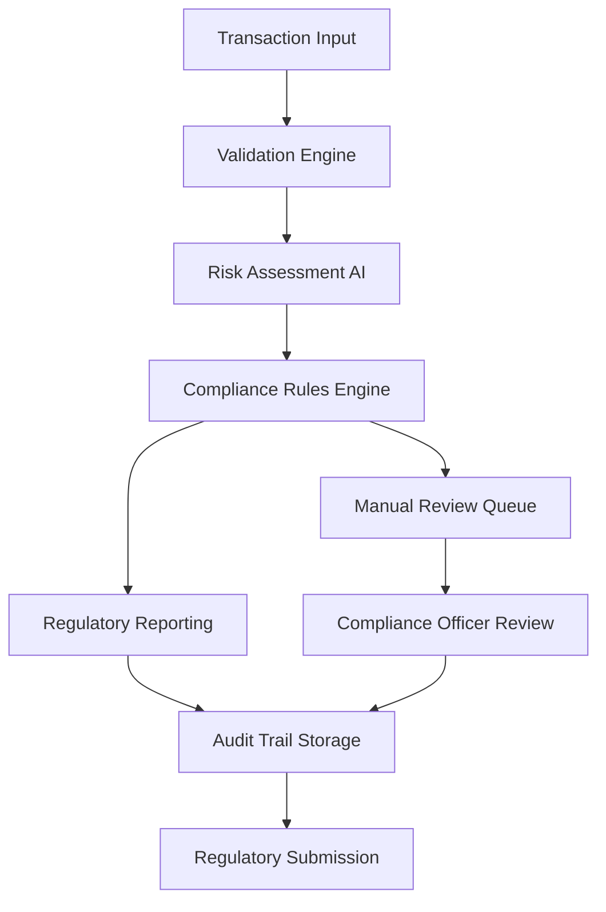

# Ensuring Financial Compliance at Scale

## The Challenge

FinanceForward, a rapidly growing fintech company, needed to process over 100,000 financial transactions daily while maintaining strict regulatory compliance. Their existing system struggled with:

- **Compliance workflow complexity** across multiple regulatory frameworks
- **Audit trail inconsistencies** during system failures
- **Manual oversight requirements** causing processing delays
- **Risk assessment bottlenecks** during high-volume periods
- **Regulatory reporting delays** affecting compliance deadlines

The company faced potential regulatory penalties and needed a solution that could guarantee compliance workflow execution even during system failures.

## The Solution

FinanceForward implemented Hatchet to create a comprehensive compliance automation platform with guaranteed execution and complete audit trails:

### Compliance Workflow Architecture

```python
@hatchet.workflow()
def process_financial_transaction(context):
    transaction = context.workflow_input()

    # Step 1: Initial validation
    validated = validate_transaction.call(transaction)

    # Step 2: Risk assessment
    risk_assessment = assess_transaction_risk.call(validated)

    # Step 3: Compliance checks
    compliance_result = run_compliance_checks.call(validated, risk_assessment)

    # Step 4: Regulatory reporting
    if compliance_result["requires_reporting"]:
        reporting = generate_regulatory_reports.call(validated, compliance_result)

    # Step 5: Final approval or rejection
    final_decision = make_final_decision.call(validated, compliance_result)

    # Step 6: Audit trail completion
    complete_audit_trail.call(validated, final_decision)

    return final_decision
```

### Key Compliance Features

- **Immutable audit trails** with complete transaction history
- **Automatic compliance checks** against multiple regulatory frameworks
- **Risk scoring** with configurable thresholds and escalation
- **Regulatory reporting** with automated submission deadlines
- **Manual review workflows** for high-risk transactions

## Implementation Strategy

### Phase 1: Core Compliance Engine (6 weeks)

- Transaction validation and risk assessment workflows
- Basic audit trail generation and storage
- Integration with existing transaction processing systems

### Phase 2: Regulatory Integration (8 weeks)

- Automated reporting to regulatory bodies
- Enhanced risk scoring with machine learning models
- Manual review and escalation workflows

### Phase 3: Advanced Features (4 weeks)

- Real-time compliance monitoring and alerting
- Predictive compliance analytics
- Integration with external compliance data sources

## The Results

The Hatchet-powered compliance platform transformed FinanceForward's regulatory operations:

### Compliance Metrics

- **100% audit trail completeness** with no gaps in transaction history
- **99.95% automated compliance** processing without manual intervention
- **Sub-minute compliance decisions** for standard transactions
- **Zero regulatory penalties** since implementation

### Operational Efficiency

- **80% reduction** in compliance processing time
- **90% fewer** manual compliance reviews required
- **Real-time regulatory reporting** eliminating deadline stress
- **Automated escalation** for high-risk transactions

### Risk Management

- **75% improvement** in fraud detection accuracy
- **Real-time risk scoring** for all transactions
- **Automated suspicious activity reporting** to regulatory authorities
- **Enhanced customer due diligence** workflows

## Architecture Deep Dive

The compliance platform leverages Hatchet's durability guarantees:



### Data Flow and Durability

Every compliance workflow step is durably logged with:

- **Immutable timestamps** for all processing steps
- **Complete input/output capture** for audit requirements
- **Failure recovery** with exact state restoration
- **Regulatory-compliant data retention** with automated archival

## Regulatory Impact

> "Hatchet's guaranteed execution has been game-changing for our compliance operations. We can confidently tell regulators that every transaction has been processed according to our compliance policies, with complete audit trails available instantly."
>
> **Jennifer Liu, Chief Compliance Officer at FinanceForward**

### Regulatory Benefits

- **Complete audit trails** available within seconds of regulator requests
- **Automated compliance reporting** eliminating manual report generation
- **Guaranteed SLA compliance** with built-in workflow monitoring
- **Real-time regulatory notifications** for suspicious activities

### Audit Performance

- **99.9% audit readiness** with instant report generation
- **Zero data inconsistencies** during regulatory examinations
- **Automated evidence collection** for compliance investigations
- **Real-time compliance dashboard** for executive oversight

## Compliance-Specific Features

### Risk Scoring Engine

```python
@hatchet.step()
def assess_transaction_risk(context):
    transaction = context.step_input()

    # Multiple risk factors
    risk_factors = {
        "amount_risk": calculate_amount_risk(transaction["amount"]),
        "counterparty_risk": assess_counterparty(transaction["recipient"]),
        "geographic_risk": evaluate_geographic_risk(transaction["destination"]),
        "behavioral_risk": analyze_behavioral_patterns(transaction["sender"]),
    }

    # Aggregate risk score
    total_risk = calculate_composite_risk(risk_factors)

    # Determine required approvals
    approval_requirements = determine_approvals(total_risk)

    return {
        "risk_score": total_risk,
        "risk_factors": risk_factors,
        "approval_required": approval_requirements
    }
```

### Automated Reporting

- **Daily regulatory filings** with automatic submission
- **Suspicious activity reports** generated and filed automatically
- **Cross-border payment notifications** to relevant authorities
- **Large transaction reporting** with real-time thresholds

## Lessons Learned

### Critical Success Factors

1. **Compliance-first design**: Built workflows around regulatory requirements
2. **Immutable audit trails**: Never compromise on data integrity
3. **Automated testing**: Comprehensive compliance rule testing
4. **Regulatory liaison**: Close collaboration with compliance teams

### Implementation Best Practices

1. **Start with highest-risk workflows** to maximize compliance impact
2. **Invest heavily in monitoring** - compliance failures are expensive
3. **Plan for regulatory changes** with configurable rule engines
4. **Document everything** - compliance requires extensive documentation

## Future Compliance Roadmap

With their core compliance infrastructure solid, FinanceForward is expanding to:

- **Cross-border compliance** with international regulatory frameworks
- **AI-powered compliance monitoring** for emerging risk patterns
- **Real-time regulatory intelligence** with automated rule updates
- **Blockchain transaction compliance** for cryptocurrency operations

The Hatchet foundation has enabled FinanceForward to scale their compliance operations while maintaining the strict reliability requirements of financial services regulation.
