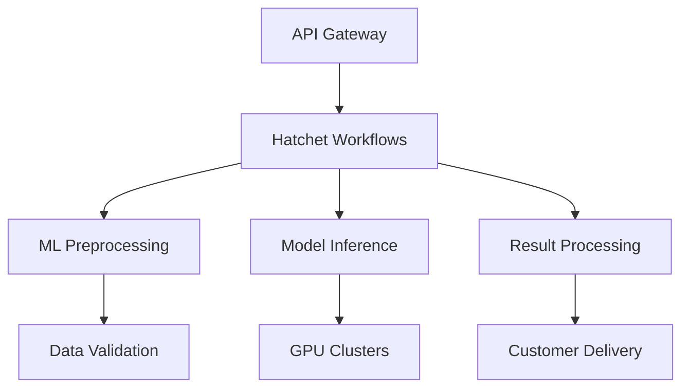

# Scaling AI Workloads with Zero Downtime

## The Challenge

AI Dynamics Inc., a fast-growing artificial intelligence startup, was struggling with their existing task processing infrastructure. As their customer base grew from hundreds to thousands of users, their homegrown queue system began showing serious limitations:

- **Processing bottlenecks** during peak usage hours
- **Failed ML inference tasks** with no retry mechanism
- **Infrastructure complexity** requiring constant manual intervention
- **Inconsistent performance** affecting customer SLI commitments

Their previous system used a combination of Redis queues and custom Python workers, which required significant engineering effort to maintain and scale.

## The Solution

AI Dynamics chose Hatchet to replace their entire background task infrastructure. The migration involved:

### 1. Task Migration

```python
# Before: Custom Redis queue implementation
@celery.task
def process_ml_inference(model_id, input_data):
    # Complex error handling and retry logic
    pass

# After: Hatchet workflow
@hatchet.workflow()
def process_ml_inference(context):
    model_id = context.workflow_input()["model_id"]
    input_data = context.workflow_input()["input_data"]

    # Automatic retries and error handling
    result = run_inference.call(model_id, input_data)
    return result
```

### 2. Workflow Orchestration

The team restructured their ML pipeline into discrete, composable steps:

- **Data preprocessing** with automatic validation
- **Model loading** with intelligent caching
- **Inference execution** with checkpointing
- **Result post-processing** and delivery

### 3. Infrastructure Simplification

By adopting Hatchet, AI Dynamics was able to:

- Remove Redis cluster management
- Eliminate custom worker monitoring
- Reduce deployment complexity by 70%

## The Results

The migration to Hatchet delivered immediate and measurable improvements:

### Performance Metrics

- **99.9% uptime** during peak ML inference periods
- **Sub-35ms P95 latency** for task assignment
- **3x throughput increase** without additional infrastructure
- **Zero data loss** during processing failures

### Operational Benefits

- **60% reduction** in infrastructure management overhead
- **Automated failover** during instance failures
- **Real-time monitoring** with built-in observability
- **Simplified deployments** with blue-green workflows

### Cost Impact

- **40% infrastructure cost reduction** through better resource utilization
- **2 FTE savings** in DevOps engineering time
- **Faster time-to-market** for new ML features

## Key Learnings

> "Hatchet allowed us to focus on our core AI capabilities instead of building and maintaining queue infrastructure. The built-in durability and retry mechanisms gave us confidence that our customer workloads would complete successfully, even during infrastructure hiccups."
>
> **Sarah Chen, VP of Engineering at AI Dynamics**

The migration highlighted several important factors for success:

1. **Start small**: Begin with non-critical workflows to build confidence
2. **Leverage durability**: Use Hatchet's checkpointing for long-running ML tasks
3. **Monitor early**: Set up observability from day one to track performance
4. **Plan for scale**: Design workflows with horizontal scaling in mind

## Technical Architecture

The final architecture leveraged Hatchet's distributed processing capabilities:



This distributed approach enabled AI Dynamics to scale individual components independently based on demand patterns.

## Looking Forward

With Hatchet handling their core infrastructure, AI Dynamics is now focusing on:

- **Advanced ML pipelines** with multi-step model ensembles
- **Real-time inference** for sub-second response requirements
- **Global deployment** across multiple cloud regions
- **Enhanced observability** with custom metrics and alerting

The solid foundation provided by Hatchet has enabled the engineering team to innovate faster while maintaining the reliability their customers depend on.
