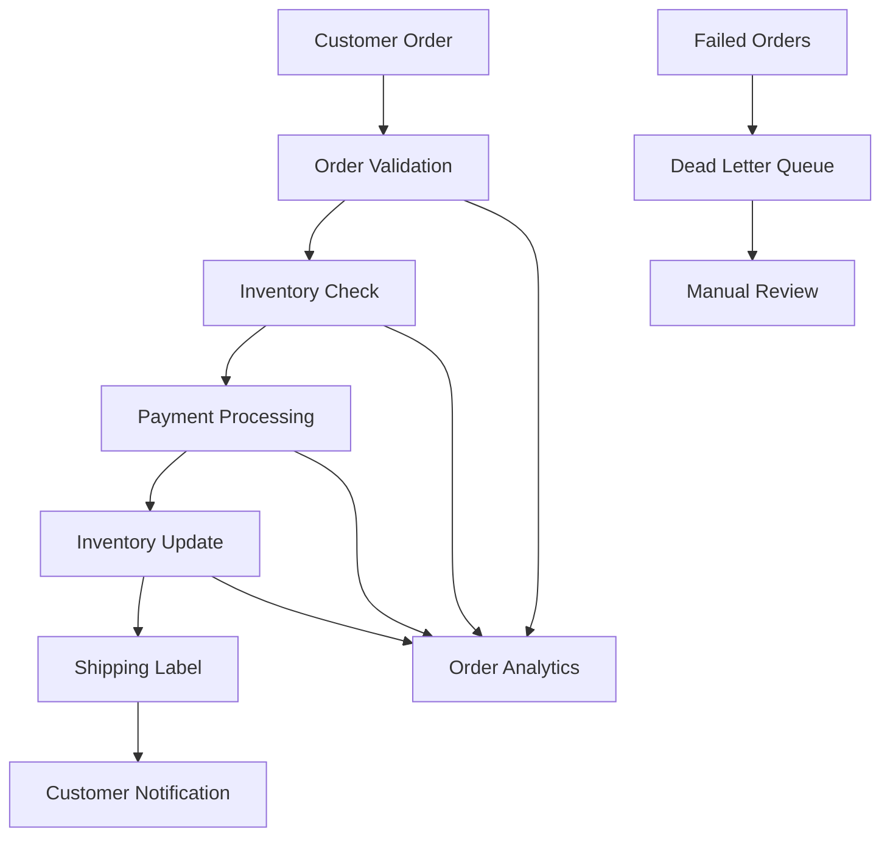

import { Logo } from "~/components/Logo/Logo";

## How Moonhub Leverages Hatchet to Optimize Task Queue Management and Scale Their AI-Driven Recruiting Platform

> "Implementing Hatchet has revolutionized our task management system, enabling us to handle a growing number of background tasks efficiently."
>
> "Hatchet's seamless scalability and real-time streaming capabilities have significantly enhanced our platform's performance and user experience."

<Logo />

- **System failures** during Black Friday and holiday seasons
  - **System failures** during Black Friday and holiday seasons
  - **System failures** during Black Friday and holiday seasons
- **Lost orders** due to queue processing failures
- **Inconsistent inventory updates** causing overselling
- **Manual intervention** required for failed payment processing
- **Complex retry logic** that was difficult to maintain and debug

Their legacy system combined multiple technologies (RabbitMQ, custom workers, and stored procedures) creating a fragile pipeline that required constant monitoring.

## The Solution

ShopFlow implemented Hatchet to create a unified, resilient order processing workflow that could handle their peak traffic demands:

### Order Processing Workflow

```python
@hatchet.workflow()
def process_order(context):
    order_data = context.workflow_input()

    # Step 1: Validate order
    validated_order = validate_order.call(order_data)

    # Step 2: Check inventory (with automatic retries)
    inventory_check = check_inventory.call(validated_order)

    # Step 3: Process payment
    payment_result = process_payment.call(validated_order, inventory_check)

    # Step 4: Update inventory
    inventory_update = update_inventory.call(validated_order, payment_result)

    # Step 5: Generate shipping label
    shipping_label = create_shipping_label.call(validated_order, inventory_update)

    # Step 6: Send confirmation
    send_confirmation.call(validated_order, shipping_label)

    return {"order_id": validated_order["id"], "status": "completed"}
```

### Key Implementation Features

1. **Atomic transactions** ensuring data consistency
2. **Automatic retries** with exponential backoff for transient failures
3. **Checkpointing** allowing workflows to resume after interruptions
4. **Dead letter handling** for permanently failed orders
5. **Real-time monitoring** with comprehensive dashboards

## Implementation Process

### Phase 1: Critical Path Migration (2 weeks)

- Order validation and inventory checking
- Payment processing with retry logic
- Basic monitoring and alerting

### Phase 2: Enhanced Features (4 weeks)

- Shipping integration with multiple carriers
- Customer notification workflows
- Return and refund processing

### Phase 3: Optimization (2 weeks)

- Performance tuning for peak load
- Advanced monitoring and analytics
- Integration with existing business intelligence tools

## The Results

The Hatchet implementation delivered transformational improvements to ShopFlow's order processing:

### Reliability Metrics

- **99.99% order completion rate** during peak traffic periods
- **Zero lost orders** during the last Black Friday (previously ~0.1% loss rate)
- **Automatic recovery** from 99.8% of transient failures
- **Sub-second detection** of processing issues

### Performance Improvements

- **3x faster** order processing during peak hours
- **50% reduction** in payment processing timeouts
- **90% fewer** manual interventions required
- **Real-time inventory** updates eliminating overselling

### Cost Benefits

- **60% infrastructure cost reduction** by optimizing resource usage
- **$2M annual savings** from eliminating order processing errors
- **3 FTE reduction** in operations team requirements
- **Faster deployments** reducing engineering overhead

## Architecture Overview

The new order processing architecture built on Hatchet:



## Customer Impact

> "Since implementing Hatchet, we've had zero customer-facing order processing failures during our busiest shopping periods. Our customers now have complete confidence that their orders will be processed correctly and on time."
>
> **Mike Rodriguez, CTO at ShopFlow**

Customer satisfaction metrics showed significant improvement:

- **25% increase** in customer satisfaction scores
- **80% reduction** in order-related support tickets
- **15% increase** in repeat purchase rates
- **Near-zero complaints** about lost or delayed order processing

## Lessons Learned

### What Worked Well

1. **Incremental migration**: Starting with the core order flow reduced risk
2. **Comprehensive monitoring**: Early visibility into workflow performance was crucial
3. **Team training**: Investing in developer education accelerated adoption
4. **Testing strategy**: Extensive load testing prevented issues during peak periods

### Key Recommendations

1. **Plan for peak loads** from day one - don't wait for traffic spikes
2. **Implement monitoring** before going live with production workflows
3. **Use feature flags** to gradually roll out new workflow capabilities
4. **Document everything** - workflow dependencies and retry policies

## Future Roadmap

With their order processing foundation solid, ShopFlow is expanding Hatchet usage to:

- **Personalization workflows** for product recommendations
- **Fraud detection pipelines** with machine learning integration
- **Supply chain optimization** with vendor integration workflows
- **Customer service automation** for common support requests

The success of the order processing implementation has made Hatchet the standard choice for all new background processing requirements at ShopFlow.
